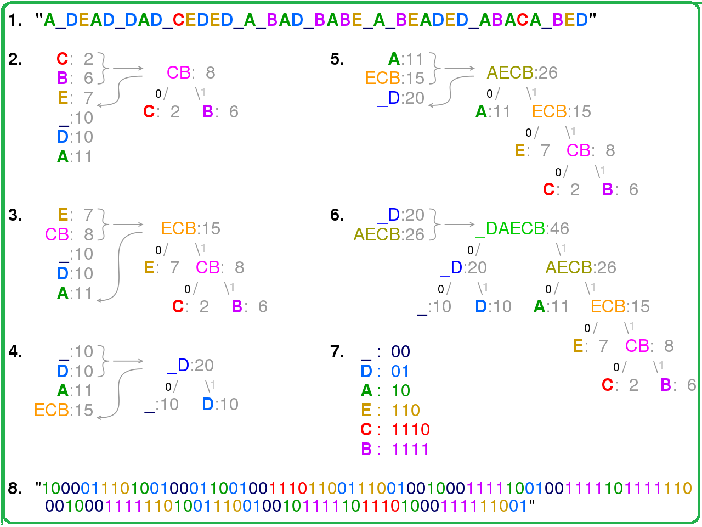
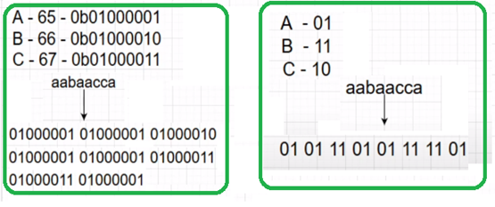
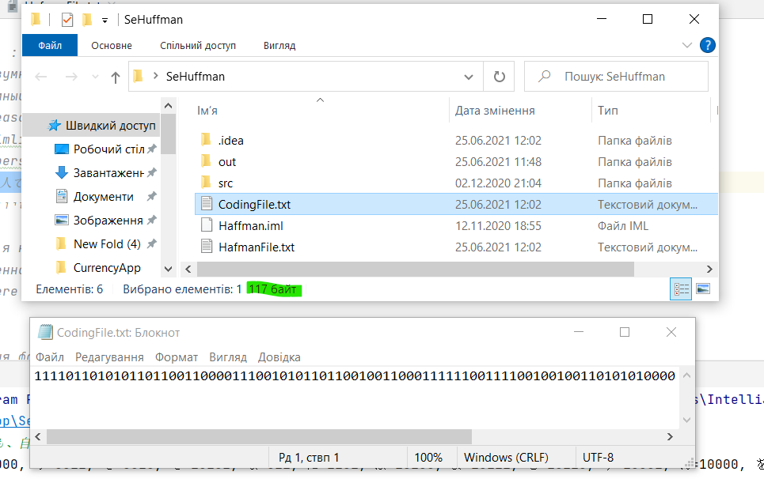
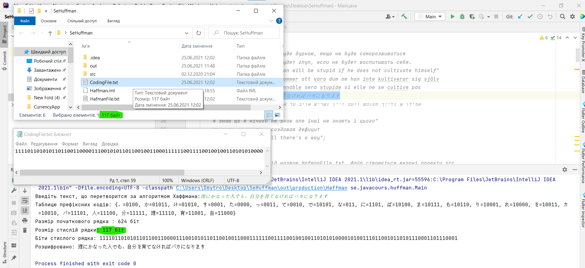
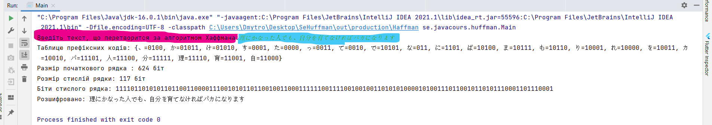
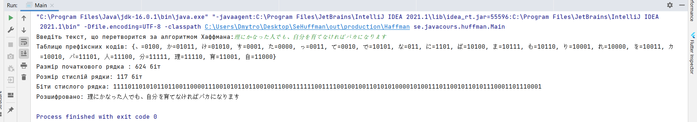

# Huffman
SeHuffman - Huffman encoding and decoding, recording files in the text (txt)

# What its  ?
One of the first algorithms for efficient coding of information was proposed in 1952 by David Huffman. The idea of ​​the algorithm is as follows: knowing the probability of occurrence of characters in the message, you can describe the data of the construction of codes of variable length to consist of an evil number of bits. Symbols are more likely to be matched by shorter codes. Huffman codes have the property of prefix (that is, no code word is a prefix smaller), which allows you to uniquely decode them.

# How this work ?
The classical Huffman algorithm on the input tables of the frequencies encountered by the symbols in the message. Next, a selection of the Huffman coding tree (H-tree) is built on a selection of these tables:
1. The characters of the input alphabet create a list of free nodes. Each letter has a weight, which can be equal to or probability, or when characters enter a compressed message;
2. Two free knots of a tree with the smallest weights are chosen;
3. Create their parent node with a weight equal to their total weight;
4. The parent node is added to the list of free nodes, and two of its descendants are removed from this list;
5. One arc, which comes out of the parent node, in response to bit 1, the other - bit 0;
6. The steps, starting with the other, are repeated until, leaving only one free node in the list of free nodes. He will consider the root of the tree.

**Fore example :
A=15 B=7	C=6	D=6	E=5**

# Screenshots 

